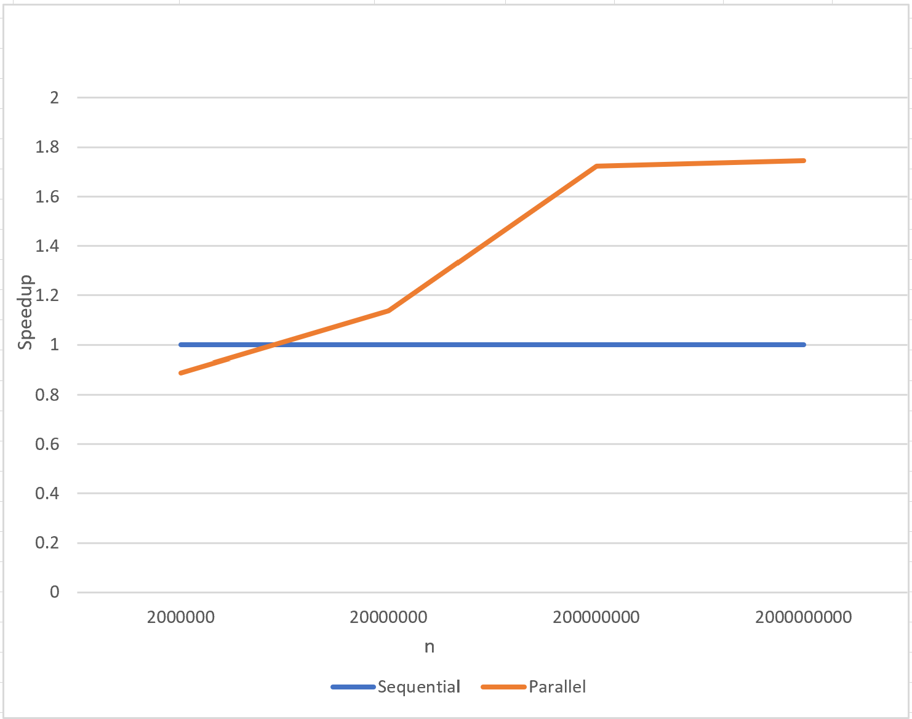

# IN4030 - Oblig 3
## 1. Introduction – what this report is about.
This report is about the oblig 3 in the UiO coarse IN4030 (Efficient parallel programming). In this report I'm solving the process of finding large prime numbers & factorizing large numbers.
It demonstrates the usage of Sieve of Eratosthenes and how paralellization can make this process more efficient.

## 2. User guide – how to run your program (short, but essential), include a very simple example.
The program can be run using the command:
```
java -cp target/IN4030-oblig-3-1.0-SNAPSHOT.jar src.Main <n> <t> <m>
```
- n - Program will generate all primes up to n and factorize the 100 largest numbers less than n*n
- t - How many threads to use. if zero then the program uses the number of cores on the machine
- m - Which mode to use. Can be the following:
    - 0: runs the program sequentially
    - 1: runs the program in parallel
    - 2: runs benchmarks and prints these times
    - 3: runs tests
    
Example usage for running sequentially for 20000000:
```
java -cp target/IN4030-oblig-3-1.0-SNAPSHOT.jar src.Main 20000000 0 0
```

Example usage for running parallel for 20000000 with 4 threads:
```
java -cp target/IN4030-oblig-3-1.0-SNAPSHOT.jar src.Main 20000000 4 1
```

Example usage for running benchmarks:
```
java -cp target/IN4030-oblig-3-1.0-SNAPSHOT.jar src.Main 20000000 0 2
```

Example usage for running tests:
```
java -cp target/IN4030-oblig-3-1.0-SNAPSHOT.jar src.Main 20000000 0 3
```

### Parallel Sieve of Eratosthenes – how you did the parallelization – consider including drawings.
Given that the number n should be factorized.
#### 1:


 First I used the sequential sieve to obtain all prime numbers up to m (red line). In order to obtain these numbers, the sequential sieve
had to mark all numbers from 0 to p (green line) and then collect the primes (numbers which was not marked). This sequential part is relatively fast as it's only iterating double square root of n. The iteration is also skipping:
 - Skipping even numbers
-  Skipping by 2p
 - Starting to read from p*p


#### 2:


Now that I had primes from 0 to m (in red), I could start marking the numbers from 0 to n (black line). In order to parallelize it, I decided to split 0 to n so each thread only calculates for a certain portion. Since we're using bytearrays for splitting and skipping even numbers,
it's important that we split so each thread doesn't start at the middle of a byte, but rather starts at the following 16th byte.

#### 3:

 Now that we've marked all numbers from 0-n, we have a bitarray of marked numbers (numbers which is not prime numbers). All we have to do at the end is sequentially convert this bitarray to an array of integer with prime numbers from 0-n


<br />
<br />
<br />
<br />
<br />

### 4. Parallel factorization of a large number – how you did the parallelization – consider including drawings
(Before starting this process, it's important to know the prime numbers has already been generated by the sieve)
#### 1:
   

 The prime numbers were evenly distributed among all threads. Each thread would be responsible for around the same amount of prime numbers to mark
#### 2:
   

 In each thread, it iterates the assigned primes and check if the prime number is a factor in n. If yes, it will add this prime to an array, otherwise it will continue searching.
#### 3:
   

After all threads were finished, they had a local array of factors. The final thing we have to do is to merge these arrays and add the remainder if there is any. Then we have the complete factorization and are finished.


### 5. Implementation – a somewhat detailed description of how your Java program works & how tested.
The main method should be used for launching the program. See 2. (User guide) on how to launch it. Based on the input the program either:
1. Runs sequentially where it's using the precode for the sieve. Then it factorizes using the sequentially code which I created.
2. Runs parallel. In this process, It's using the parallel sieve which I've built to obtain the prime numbers. After this, it uses the result of the prime numbers to factorize in parallel.
3. Runs benchmarks. In this process, it's taking every individual process (sequential sieve, sequential factorization, parallel sieve, parallel factorization) and measures the time for each of these. It also displays the speedsup achieved. It calculates the median runtime of total 7 runs.
4. Runs tests. In this case it's doing the whole procedure of factorizing sequential and factorizing in parallel. After completed, it compares the outout of the results for each sequential & parallel and ensures these are equal.


### 6. Measurements – includes discussion, tables, graphs of speedups for the four values of N, number of cores used.
Note: Time in in milliseconds
#### Cores used: 8

#### Sieve:
| n     | Sequential    | Parallel  | Speedup|
|-------|---------------|-----------|--------|
|2000000|7.872         |9.917     |0.793   |
|20000000|70.986        |67.679     |1.048   |
|200000000|834.93      |529.069    |1.578   |
|2000000000|13295.718   |8012.440   |1.659   |




#### Factorization:
| n     | Sequential    | Parallel  | Speedup|
|-------|---------------|-----------|--------|
|2000000|8.158         |14.262     |0.571   |
|20000000|33.353        |62.52     |0.533   |
|200000000|292.323      |523.201    |0.558   |
|2000000000|981.110   |2230.00   |0.439   |


#### Sieve + Factorization
| n     | Sequential    | Parallel  | Speedup|
|-------|---------------|-----------|--------|
|2000000|29.927         |49.893     |0.599   |
|20000000|126.557        |125.974     |1.004   |
|200000000|1103.679      |1063.148    |1.0381   |
|2000000000|15830.695   |11203.972   |1.4129   |


#### Discussion of the results
From the results we can first see that paralleling the sieve seems to give a speedup. Once n increases, the efficiency of multithreading the program is also increasing. At 2 billion, we have a speedup for around 1.7 which means that the
algorithm almost runs twice the speed due to running multithreaded. For smaller numbers however, it's not giving large speedsup. For e.g 2000000 we see that we only achieve speedup of 1.066.
We can also see that the parallel sieve does complete at 9401.941 which is below the requirement of the sieve completing in 30 seconds.

Over to the factorization part, we can see that the speedup actually decreases as n becomes larger. I was expecting the speedup to also increase as n increased for this algorithm, however the opposite occurred. I believe this occurs as
the sequential algorithm performs quite fast (1036.304 for 2 billion) and is able to stop earlier if it recognizes that it's completed. For the parallel algorithm however, it's not able to do the same which influences that it's slower as n increases.
It is however able to complete in around 9.4 seconds, or a total of 18030.864 for parallel sieve + parallel factorization which is below the requirement of 60 seconds. Due to this, I don't believe there's an bug in the algorithm, but simply that the sequential algorithm has internal code where it's able to conclude that it's finished earlier (only possible when running sequential)


### 7. Conclusion – just a short summary of what you have achieved
We can see that parallelling the sieve does give a speedup, especially once n becomes larger.
Paralleling the factorization however did not give a speedup for my algorithms. As a result, the algorithms performs at about the same rate. Sequential factorization is faster in my tests and parallel sieve is faster in my tests.


### 8. Appendix – the output of your program.
Here is an example of output which outputs when running benchmark's: <br />
Running benchmarks. This can take a while, please wait...<br />
Starting benchmarking sieves...<br />
Sequential Sieve used median time 7.872ms for n = 2000000<br />
Parallel Sieve used median time 9.917ms for n = 2000000<br />
Speedup: 0.7937884440859131<br />
Sequential Sieve used median time 70.9863ms for n = 20000000<br />
Parallel Sieve used median time 67.679ms for n = 20000000<br />
Speedup: 1.04886744780508<br />
Sequential Sieve used median time 834.9304ms for n = 200000000<br />
Parallel Sieve used median time 529.0699ms for n = 200000000<br />
Speedup: 1.5781098111988605<br />
Sequential Sieve used median time 13295.7182ms for n = 2000000000<br />
Parallel Sieve used median time 8012.4406ms for n = 2000000000<br />
Speedup: 1.6593843079473187<br />
Finished benchmarking sieves...<br />
--------------------------------<br />
Starting benchmarking factorization...<br />
Sequential Factorization used median time 8.1583ms for n = 2000000<br />
Paralell Factorization used median time 14.2629ms for n = 2000000<br />
Speedup: 0.5719944751768574<br />
Sequential Factorization used median time 33.3533ms for n = 20000000<br />
Paralell Factorization used median time 62.5224ms for n = 20000000<br />
Speedup: 0.5334616073599222<br />
Sequential Factorization used median time 292.3231ms for n = 200000000<br />
Paralell Factorization used median time 523.2015ms for n = 200000000<br />
Speedup: 0.558719919572096<br />
Sequential Factorization used median time 981.1106ms for n = 2000000000<br />
Paralell Factorization used median time 2230.009ms for n = 2000000000<br />
Speedup: 0.43995813469811107<br />
Finished benchmarking factorization...<br />
--------------------------------<br />
Starting benchmarking sieve + factorization...<br />
Sequential sieve + factorization used median time 29.927ms for n = 2000000<br />
Parallel sieve + factorization used median time 49.8937ms for n = 2000000<br />
Speedup: 0.5998152071303591<br />
Sequential sieve + factorization used median time 126.557ms for n = 20000000<br />
Parallel sieve + factorization used median time 125.9742ms for n = 20000000<br />
Speedup: 1.0046263441244319<br />
Sequential sieve + factorization used median time 1103.679ms for n = 200000000<br />
Parallel sieve + factorization used median time 1063.1489ms for n = 200000000<br />
Speedup: 1.0381226938202166<br />
Sequential sieve + factorization used median time 15830.6955ms for n = 2000000000<br />
Parallel sieve + factorization used median time 11203.9723ms for n = 2000000000<br />
Speedup: 1.412953823529178<br />
Finished benchmarking sieve + factorization<br />
--------------------------------<br />
<br />
Process finished with exit code 0<br />


### Java measurement harness
### How to run Java Measurement harness
Run the command
```
java -jar target/benchmarks.jar
```

### Details about the procude of running
The measurement begins with warming up in order to make sure that:
- Program is in memory/cache
- JIT has done it's optimizations
- The data has been read from disk
- The data has been through memory/cache

It warms up once. After this, it runs 3 iterations of the benchmarks and collects the results of these runs. We can see the results as following for n=200_000_000:
#### Sequential sieve + factorization
```
Iteration   1: 1.201 s/op
Iteration   2: 1.161 s/op
Iteration   3: 1.139 s/op


Result "src.JbhBenchmarks.testSequential":
  1.167 ±(99.9%) 0.575 s/op [Average]
  (min, avg, max) = (1.139, 1.167, 1.201), stdev = 0.032
  CI (99.9%): [0.592, 1.742] (assumes normal distribution)


```
#### Parallel sieve + factorization
```
Iteration   1: 0.928 s/op
Iteration   2: 0.959 s/op
Iteration   3: 0.948 s/op


Result "src.JbhBenchmarks.testParallel":
  0.945 ±(99.9%) 0.284 s/op [Average]
  (min, avg, max) = (0.928, 0.945, 0.959), stdev = 0.016
  CI (99.9%): [0.661, 1.229] (assumes normal distribution)

```

#### Comparison
```
Benchmark                     Mode  Cnt  Score   Error  Units
JbhBenchmarks.testParallel    avgt    3  0.945 ± 0.284   s/op
JbhBenchmarks.testSequential  avgt    3  1.167 ± 0.575   s/op

```
From the benchmarks we can see that we can run the sequential procedure around 1.167 per second the parallel procedure 0.945 per second.
We can also see that we've achieved a speedup of around 1.15 by running it parallel. We concluded these results by seeing the time it took on average running a total of 3 runs for each
parallel and sequential. Due to the warmup, I believe the variance for each run is lower between each run. We can also see from the results that there is not much variance between each run. As there's
not much variance, using the average time seems like a good fit. We could potentially run the methods more than 3 times, but for this benchmarking I thought it was sufficient. As a summary, the results can be used
to argue that paralleling this procedure for such number n does improve the speed of the algorithm.


The benchmarks are set to report the average time usage


## How does factorizationa nd Sieve of Sieve of Eratosthenes work? (Not neccesairy to read for examiner)
### Prime number
A prime number is a whole number which is only dividable by itself and 1

#### Finding prime numbers using Sieve of Eratosthenes?
Given the numbers 1-17
- We ignore 1 (x)
- Second number is 2, we underline it. It's a prime
- Then we jump by 2, cross that out, jump by 2, cross that out, jump by 2, cross that out... (2,4,6,8,10,12,14,16 are crossed out)
- Then we go to next number which has not been crossed out (3). That's a prime number and cross out every jump by 3 (6, 9, 12, 15 crossed out if not already)
- Then we go to next number which is not crossed out, (5) which is a prime number and cross out every jump by 5 (10, 15 if not crossed out already)
- Then we go to 7, but 7  is greater than of the maximum number now (17). It means that the remaining numbers which are not crossed out, is primes (11, 13, 17)
- We should also remove the even numbers before starting this process (besides 2).
- We can do the stepping by starting looking at numbers from p*p (e.g for 3 we start at 9, or for 7 we start at 49)
- If we're stepping forward with 3 we hit an odd number each 2 time (3, 6(odd), 9, 12(odd)) so we can skip jump by 6 all the time (2*p)

### Factorization
Any number higher than 1 is possible to factorise as a product of prime numbers
N = p1 * p2 * p3 * px.
E.g 4 = 2*2 (2 is a prime number)
E.g 6 = 3*2 (3 and 2 is prime number)
If you ignore the order of the factorised numbers, there's only one possible combination (so 6 can be factorised as 3*2 or 2*3 but if you ignore the order they are the same). In this submission we order them from highest to lowest
If there's only one number in this factorization, the number itself is a prime number.

#### Finding factorization number
If we wanna factorize e.g 532 the way we do is:
- Start taking numbers from the sieve, starting with 2
- Try divide that into 532: 532/2 = 266. So current factorization is 2
- Then we retry to divide it by the number again: 266/2 = 133. Current factorization is 2*2
- Then we try again 133/2 which doesnt work.
- So we step to the next number in the sieve (3) and check that it's not greater than the square root of by multiple 3*3 (9) and checking that its not higher than
- 3 is also not dividable, so we go to next number in sieve (5), not dividable by 133.
- So we go to next number (7). It's dividable by 7! So we end up with 19 and the factorisation 2 * 2 * 7.
- Then we try 7 again and check if it divides by 17. But before this, we have to check if we should keep trying:
- We should stop trying whenever the candidate is greater than the square root of the number we're working on (square root of 19 is less than 5. And 7 is greater than this so we should stop trying)
- So we have reached out stop condition. If there is a number left (19 in this case) we know it's a prime number and therfore also a factor.
- So the factorization is now 2*2*7*19.

